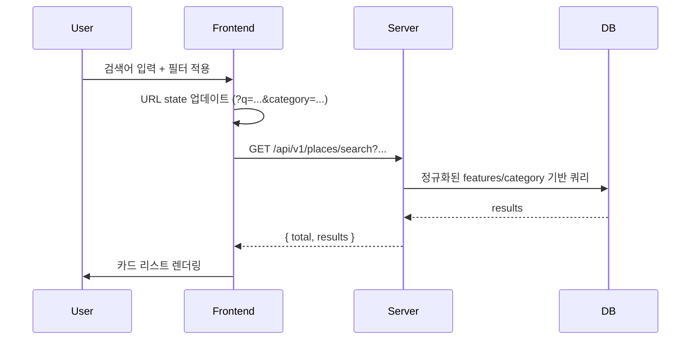
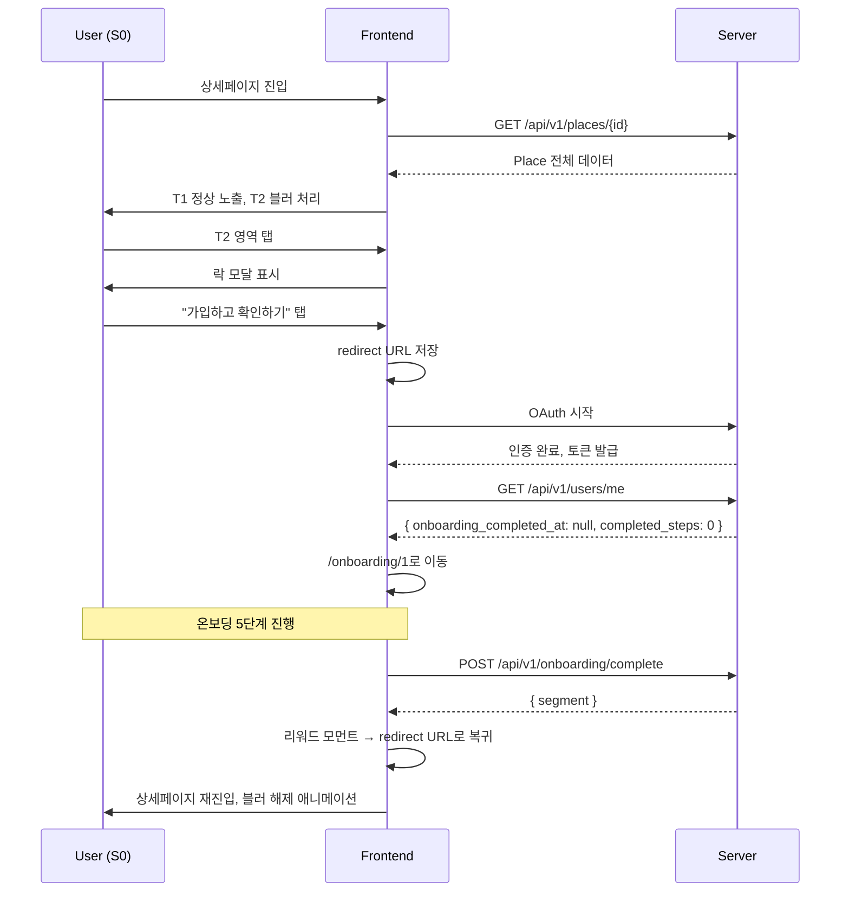

# 📄 VIVAC MVP Phase-1 Data Model & API Spec (v0.1)

## 1. 문서 메타정보

| 항목 | 내용 |
|---|---|
| 문서명 | VIVAC MVP Phase-1 Data Model & API Specification |
| 버전 | v0.1 (Draft) |
| 작성일 | 2026-04-29 |
| 주요 대상 | 백엔드 엔지니어, 프론트엔드 개발자 |
| 상태 | 검토중 (B1~B6 협의 결과에 따라 v0.2 업데이트 예정) |

---

## 2. 작성 원칙

### 2.1 본 문서의 위치
- 본 문서는 **프론트엔드 관점에서 필요한 API 형태**를 정의한 초안입니다
- 백엔드와의 협의를 통해 최종 확정됩니다
- "협의 필요" 표시된 항목은 `backend-discussion-points.md`의 항목과 연동됩니다

### 2.2 API 설계 원칙
- **REST 기반**, 명사 중심 URL
- **버전 prefix**: `/api/v1/...`
- **HTTP 상태 코드** 표준 준수
- **에러 응답** 통일된 구조
- **인증** Bearer 토큰 또는 httpOnly 쿠키 (P3 협의)
- **Pagination**: offset 기반 (`page`, `size`) — 향후 cursor 기반 마이그레이션 가능

### 2.3 명세 형식
각 API에 대해:
- HTTP Method + URL
- Path / Query / Body 파라미터
- 응답 스키마
- 에러 응답
- 호출 화면 / 사용처

---

## 3. 데이터 모델

### 3.1 Place (장소) — 핵심 엔티티

기존 통합 스키마 + Phase-1 협의 결과 반영.

| 필드 | 타입 | 필수 | 설명 | Tier | 비고 |
|---|---|---|---|---|---|
| `id` | uuid | ✅ | 장소 고유 식별자 | - | VIVAC UID |
| `title` | varchar(200) | ✅ | 야영장명 | T1 | |
| `tagline` | varchar(300) | | 한줄설명 | T1 | |
| `description` | text | | 상세설명 | T2 | |
| `thumbnail_url` | varchar(500) | | 카드용 썸네일 | T1 | **B1 협의** |
| `image_urls` | jsonb (string[]) | | 갤러리 이미지 배열 | T1 | **B1 협의** |
| `image_count` | int | | 이미지 개수 | T1 | **B1 협의** |
| `region_province` | varchar(50) | ✅ | 도/광역시 | T1 | |
| `region_city` | varchar(50) | ✅ | 시군구 | T1 | |
| `address` | varchar(300) | ✅ | 주소 | T1 | |
| `address_detail` | varchar(200) | | 상세주소 | T1 | |
| `features` | jsonb (string[]) | | 특징 코드 배열 | T1 | **B5 협의** (정규화 코드) |
| `amenities` | jsonb (string[]) | | 부대시설 코드 배열 | T1 | **B5 협의** (정규화 코드) |
| `category` | varchar(50) | | 카테고리 코드 | T1 | **B4 협의** |
| `business_type` | varchar(50) | | 사업주체 | T2 | |
| `operation_type` | varchar(50) | | 운영주체 (공영/사설) | T2 | |
| `operating_agency` | varchar(200) | | 운영기관 | T2 | |
| `operating_status` | varchar(20) | ✅ | 운영상태 | T1 | **B6 협의** |
| `total_area_m2` | int | | 전체면적 (m²) | T2 | |
| `phone` | varchar(20) | | 전화번호 | T1 | |
| `website_url` | varchar(500) | | 홈페이지 URL | T2 | 락 적용 |
| `booking_url` | varchar(500) | | 예약 URL | T2 | 락 적용 |
| `latitude` | decimal(10,7) | | 위도 | - | Phase-2(지도) |
| `longitude` | decimal(10,7) | | 경도 | - | Phase-2(지도) |
| `created_at` | timestamp | ✅ | 생성일 | - | |
| `updated_at` | timestamp | ✅ | 수정일 | - | |
| `source` | varchar(50) | ✅ | 데이터 출처 | - | "gocamping"/"forest"/"nationalpark" 등 |
| `raw_data` | jsonb | | 원본 데이터 | - | 디버깅/재처리용 |

**Tier 표기**:
- `T1`: Free Tier에 노출
- `T2`: Member Tier만 노출 (Free Tier에는 블러 또는 락)
- `-`: 내부 필드 (UI 미노출)

### 3.2 User (사용자)

| 필드 | 타입 | 필수 | 설명 |
|---|---|---|---|
| `id` | uuid | ✅ | 사용자 고유 식별자 |
| `email` | varchar(200) | ✅ | 구글 OAuth 이메일 |
| `nickname` | varchar(50) | ✅ | 닉네임 (자동 생성 또는 수정) |
| `provider` | varchar(20) | ✅ | "google" |
| `provider_id` | varchar(100) | ✅ | 구글 sub |
| `onboarding_completed_at` | timestamp | | 온보딩 완료 시각 |
| `tier` | varchar(20) | ✅ | "free" / "member" |
| `created_at` | timestamp | ✅ | 가입일 |
| `updated_at` | timestamp | ✅ | 수정일 |

> 💡 `tier`는 `onboarding_completed_at` 기반으로 derive 가능하지만, 향후 Pro 티어 확장 대비 별도 필드로 관리.

### 3.3 OnboardingResponse (온보딩 응답)

| 필드 | 타입 | 필수 | 설명 |
|---|---|---|---|
| `id` | uuid | ✅ | |
| `user_id` | uuid | ✅ | FK |
| `step` | int | ✅ | 1~5 |
| `data` | jsonb | | 응답 데이터 (step별 스키마) |
| `is_skipped` | boolean | ✅ | 건너뛰기 여부 |
| `created_at` | timestamp | ✅ | |
| `updated_at` | timestamp | ✅ | |

UNIQUE (user_id, step)

#### Step별 data 스키마

```
Step 1: { experience_level: "beginner" | "novice" | "intermediate" | "expert" }
Step 2: { preferred_styles: string[] }   // 0~2개
Step 3: { preferred_environments: string[] }   // 0~3개
Step 4: { activity_frequency: "weekly" | "monthly" | ... }
Step 5: { primary_region: "metro" | "gangwon" | ... }
```

### 3.4 Curation (큐레이션) — P1 협의

| 필드 | 타입 | 필수 | 설명 |
|---|---|---|---|
| `id` | uuid | ✅ | |
| `type` | varchar(50) | ✅ | "legendary" / "recommended" |
| `place_id` | uuid | ✅ | FK to Place |
| `sort_order` | int | ✅ | 노출 순서 |
| `is_active` | boolean | ✅ | 노출 여부 |
| `created_at` | timestamp | ✅ | |

### 3.5 Meta (마스터 데이터) — B5 협의

옵션 B (백엔드 마스터 API) 채택 시 필요. 협의 결과에 따라 변경 가능.

#### features_master / amenities_master / categories_master

| 필드 | 타입 | 필수 | 설명 |
|---|---|---|---|
| `code` | varchar(50) | ✅ PK | 코드 |
| `label` | varchar(100) | ✅ | 한국어 라벨 |
| `icon` | varchar(50) | | 아이콘 키 |
| `description` | varchar(300) | | 툴팁 |
| `sort_order` | int | ✅ | 정렬 순서 |
| `group` | varchar(50) | | 그룹핑 |
| `is_active` | boolean | ✅ | 활성 여부 |

---

## 4. API 명세

### 4.1 인증 API — P3 협의

#### `GET /api/v1/auth/google`
구글 OAuth 시작.

| 항목 | 내용 |
|---|---|
| 요청 | 없음 (브라우저 redirect) |
| 응답 | 구글 OAuth 페이지로 redirect |

#### `GET /api/v1/auth/callback`
구글 OAuth 콜백 처리.

| 항목 | 내용 |
|---|---|
| Query | `code`, `state` |
| 응답 | 토큰 발급 + 프론트로 redirect |

#### `POST /api/v1/auth/logout`
로그아웃.

| 항목 | 내용 |
|---|---|
| 인증 | 필요 |
| 응답 | `{ success: true }` |

#### `GET /api/v1/users/me`
현재 사용자 정보.

| 항목 | 내용 |
|---|---|
| 인증 | 필요 |
| 응답 | `{ id, email, nickname, onboarding_completed_at, completed_steps, tier }` |
| 미인증 시 | 401 |

#### `POST /api/v1/auth/refresh`
토큰 갱신.

| 항목 | 내용 |
|---|---|
| Body | `{ refresh_token }` 또는 쿠키 |
| 응답 | 새 access_token |

---

### 4.2 온보딩 API — P4 협의

#### `GET /api/v1/onboarding/responses`
사용자의 온보딩 응답 전체 조회.

| 항목 | 내용 |
|---|---|
| 인증 | 필요 |
| 응답 | `{ responses: { 1: {...}, 2: {...} }, completed_steps, onboarding_completed_at }` |
| 사용처 | 온보딩 재진입 시 (S2) |

#### `POST /api/v1/onboarding/responses`
단계별 응답 저장 (upsert).

| 항목 | 내용 |
|---|---|
| 인증 | 필요 |
| Body | `{ step: 1~5, data: {...}, is_skipped: boolean }` |
| 응답 | `{ completed_steps, onboarding_completed_at }` |
| 사용처 | 온보딩 다음/이전/건너뛰기 |

#### `POST /api/v1/onboarding/complete`
온보딩 완료 처리.

| 항목 | 내용 |
|---|---|
| 인증 | 필요 |
| 응답 | `{ onboarding_completed_at, segment: {...} }` |
| segment 예시 | `{ style: "ultralight", environment: "mountain", style_label: "UL/경량", environment_label: "산·숲" }` |
| 사용처 | Step 5 완료 후 리워드 화면 |

---

### 4.3 장소 검색 API

#### `GET /api/v1/places/search`
장소 검색/필터링.

| 파라미터 | 타입 | 설명 |
|---|---|---|
| `q` | string | 검색어 |
| `category[]` | string[] | 카테고리 코드 (B4) |
| `region[]` | string[] | 지역 코드 |
| `features[]` | string[] | 특징 코드 (B5) |
| `amenities[]` | string[] | 부대시설 코드 (B5) |
| `operation_type` | string | 운영주체 |
| `sort` | string | 정렬 (Phase-1: name_asc만 동작) |
| `page` | int | 페이지 (default 1) |
| `size` | int | 페이지 크기 (default 20, max 50) |

응답:
```
{
  total: 245,
  page: 1,
  size: 20,
  results: [
    {
      id, title, tagline, thumbnail_url,
      region_province, region_city,
      features
    }
  ]
}
```

> 💡 `operating_status`는 B6에 따라 운영중만 노출. 응답 자체에서 제외.

#### `GET /api/v1/places/search/count`
필터 적용 시 결과 수만 빠르게 반환 (필터 모달 실시간 갱신용).

| 파라미터 | 타입 | 설명 |
|---|---|---|
| (search와 동일) | | |

응답: `{ total: 245 }`

---

### 4.4 장소 상세 API

#### `GET /api/v1/places/{id}`
장소 상세.

| 항목 | 내용 |
|---|---|
| Path | `id` (uuid) |
| 응답 | Place 전체 필드 (3.1 참조) |
| 미존재 | 404 |

> 💡 Tier 분류와 무관하게 모든 필드 응답. 프론트에서 시각적 처리.

---

### 4.5 큐레이션 API — P1 협의

#### `GET /api/v1/curations/legendary`
백패킹 성지 큐레이션.

| 항목 | 내용 |
|---|---|
| 응답 | `{ items: [Place 카드 정보] }` |

#### `GET /api/v1/curations/recommended`
한번쯤 가볼만한 야영지 큐레이션.

| 항목 | 내용 |
|---|---|
| 응답 | (동일 형태) |

---

### 4.6 마스터 데이터 API — B5 협의 (옵션 B 채택 시)

#### `GET /api/v1/meta/features`

응답:
```
{
  items: [
    { code: "walk_in", label: "도보 진입", icon: "walk", group: "access", sort_order: 1 }
  ]
}
```

#### `GET /api/v1/meta/amenities`
(동일 형태)

#### `GET /api/v1/meta/categories`
(동일 형태, 6개 카테고리)

#### `GET /api/v1/meta/regions`
권역 목록 (수도권, 강원권 등 7개).

> 💡 마스터 데이터 API는 변경 빈도 낮음 → 캐싱 전략 적극 활용 (Cache-Control max-age 1일 등)

---

## 5. 공통 응답 형식

### 5.1 성공 응답

```json
{
  "data": { ... }
}
```

또는 단순 객체 응답.

### 5.2 에러 응답

```json
{
  "error": {
    "code": "PLACE_NOT_FOUND",
    "message": "장소를 찾을 수 없습니다",
    "details": { ... }
  }
}
```

### 5.3 HTTP 상태 코드

| 코드 | 의미 |
|---|---|
| 200 | 성공 |
| 201 | 생성됨 |
| 204 | 성공 (응답 없음) |
| 400 | 잘못된 요청 |
| 401 | 인증 실패 |
| 403 | 권한 없음 |
| 404 | 리소스 없음 |
| 409 | 충돌 (중복 등) |
| 422 | 유효성 검증 실패 |
| 500 | 서버 에러 |
| 503 | 서비스 일시 중단 |

### 5.4 표준 에러 코드

| 코드 | HTTP | 설명 |
|---|---|---|
| `UNAUTHORIZED` | 401 | 토큰 없음/만료 |
| `FORBIDDEN` | 403 | 권한 부족 |
| `PLACE_NOT_FOUND` | 404 | 장소 없음 |
| `USER_NOT_FOUND` | 404 | 사용자 없음 |
| `VALIDATION_ERROR` | 422 | 유효성 실패 |
| `INTERNAL_ERROR` | 500 | 서버 에러 |
| `SERVICE_UNAVAILABLE` | 503 | 점검 중 |

---

## 6. 인증 흐름

### 6.1 OAuth 시퀀스

```
1. [클라이언트] /login에서 "구글로 시작하기" 탭
2. [클라이언트] window.location = /api/v1/auth/google
3. [서버] 구글 OAuth URL로 redirect
4. [구글] 사용자 인증 후 code 발급
5. [구글] /api/v1/auth/callback?code=...로 redirect
6. [서버] code를 구글에 전달, access_token + 사용자 정보 수령
7. [서버] DB에서 user 조회/생성
8. [서버] 자체 access_token 발급, httpOnly 쿠키 또는 응답 본문
9. [서버] 프론트로 redirect (/auth/callback?... 또는 직접 라우팅)
10. [클라이언트] /api/v1/users/me 호출, 사용자 상태 판별
11. [클라이언트] 상태별 라우팅 (S1→온보딩, S3→홈/redirect)
```

### 6.2 토큰 정책 (P3 협의)

권장:
- **Access Token**: httpOnly 쿠키, 1시간 만료
- **Refresh Token**: httpOnly 쿠키, 30일 만료
- **자동 갱신**: 401 응답 시 인터셉터에서 refresh 호출

---

## 7. 데이터 흐름 (Mermaid)

### 7.1 검색 데이터 흐름



### 7.2 락 트리거 → 가입 흐름



---

## 8. 백엔드 협의 사항 매핑

본 문서의 항목과 `backend-discussion-points.md`의 매핑:

| API/필드 | 관련 협의 항목 |
|---|---|
| `thumbnail_url`, `image_urls`, `image_count` | B1 (이미지 필드) |
| 이미지 호스팅 방식 | B2 |
| 이미지 부재 처리 | B3 |
| `category` 필드 매핑 | B4 |
| `features`, `amenities` 코드 체계 | B5 |
| `/api/v1/meta/*` | B5 |
| `operating_status` 응답 정책 | B6 |
| `/api/v1/curations/*` | P1 |
| 인증 API 전반 | P3 |
| 온보딩 API 전반 | P4 |

---

## 9. Phase-2 이후 확장 고려

본 명세는 Phase-1 한정이지만, 다음 확장을 염두에 둔 설계:

| 향후 기능 | 영향받는 API |
|---|---|
| 북마크 (F3) | `/api/v1/users/me/bookmarks/*` 신규 |
| 평점/리뷰 (D1) | Place에 `rating_avg`, `review_count` 필드 추가 / `/api/v1/places/{id}/reviews` 신규 |
| 가격 (D2) | Place에 `price_info` 필드 / 검색 필터 추가 |
| 지도 검색 (D3) | `/api/v1/places/search`에 `bounds`, `near` 파라미터 |
| 위치 검색 (D4) | `near=lat,lng&radius=m` 파라미터 |
| 마이페이지 (Phase-2) | `/api/v1/users/me` PATCH, 온보딩 응답 수정 |
